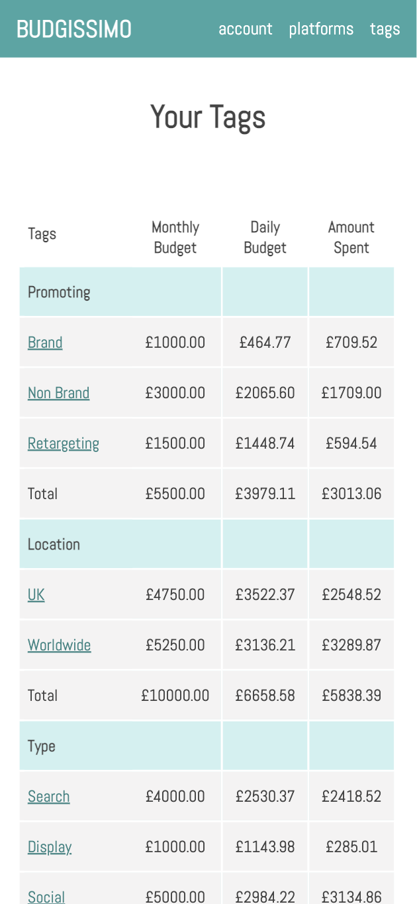
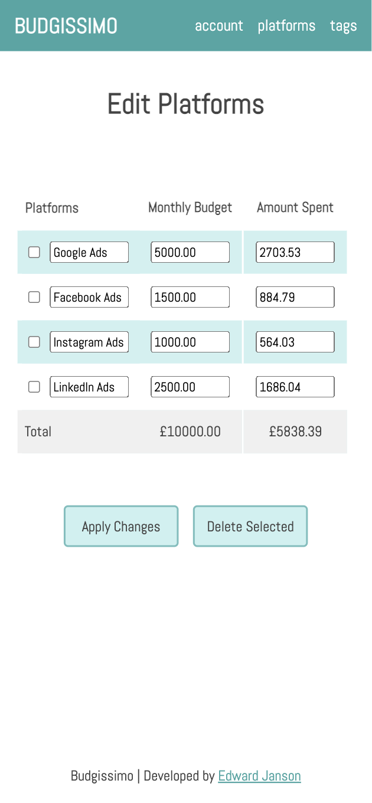

# Budgissimo | Online Advertisting Budget Tracker

## Contents 

* [Features](#features)
* [Background](#background)
* [Installation](#installation)
* [Images](#images)

<br>

## Features

- Create Platforms, Campaigns, Tag Categories and Tags.
- Set budgets and amount spent at Account, Platform, Campaign and Tag level.
- View recommended daily spend based on budget and amount spend in current month.
- Add tags to campaigns to track spend across platforms.

<br>

## Background

This mobile first app allows users to keep track of their online advertising budgets and spending across multiple platforms and campaigns. Tags can be added to campaigns that share:
- a common targeting location e.g., UK 
- promotion e.g. 'Christmas Offer'
- and more.

With tags, budget and spend can be viewed across multiple platforms in a single table.

<br>

## Installation

Python 3 and postgreSQL are required to install the app.

To install the dependencies, build the database structure and launch with starter data, run the following commands in your CLI:
```
pip3 install -r requirements.txt
createdb budgissimo
psql -d budgissimo -f db/budgissimo_manager.sql
python3 console.py
```
To run the app:
```
flask run
```

<br>

## Images

#### Tags Page


<br>

#### Platforms Edit Page

